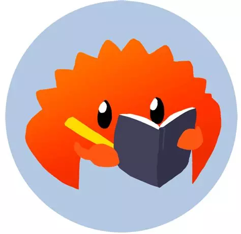

# RUST-TUTO
- [RUST-TUTO](#rust-tuto)
  - [Description](#description)
  - [Rustlings](#rustlings)
  - [Useful links](#useful-links)

## Description  

This repo contains rust tutorial projects

## Rustlings 

This also contains a project called [rustlings](https://rustlings.rust-lang.org/), which contains rust pratical exercises. You can access thoses exercises in [this folder](./rustlings/) 

## Useful links
- [The RUST programming language](https://doc.rust-lang.org/book/title-page.html)
- -[Rustlings](https://rustlings.rust-lang.org/)